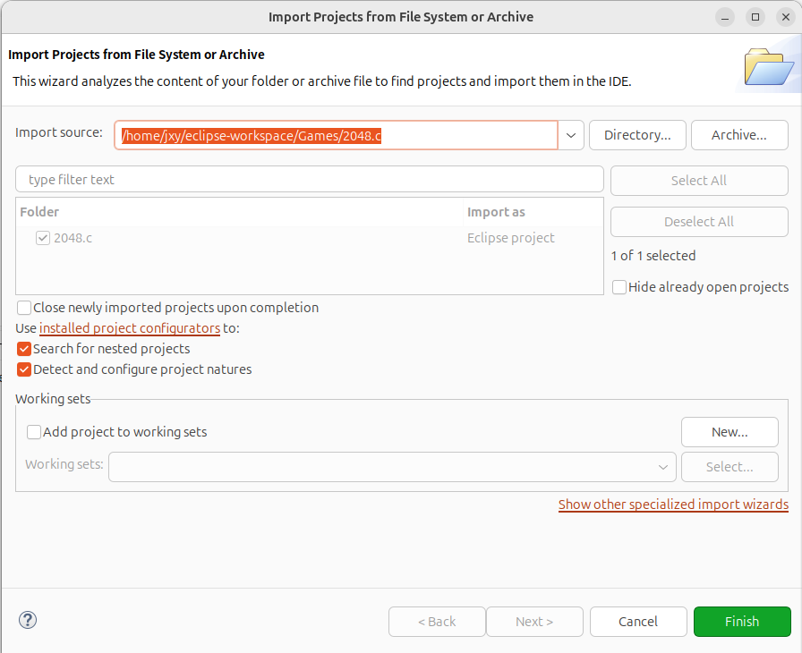
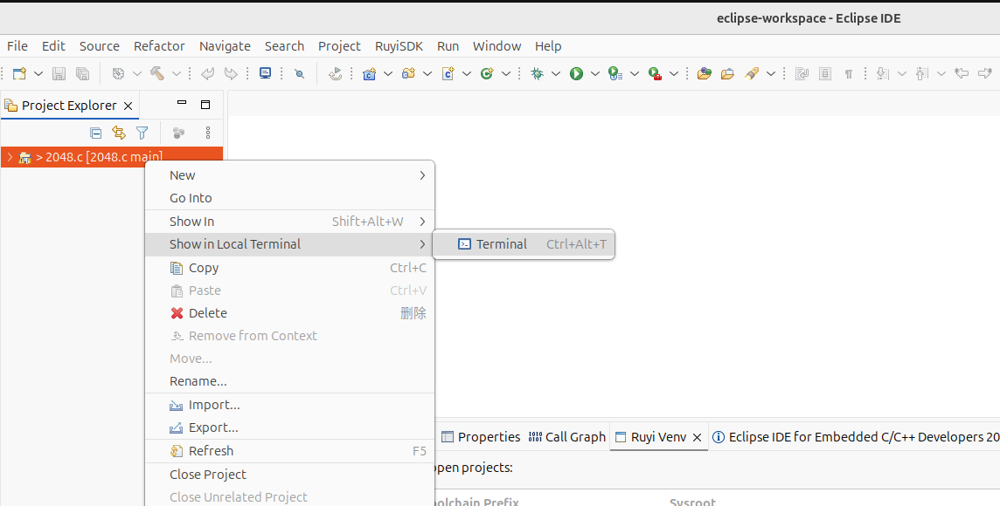
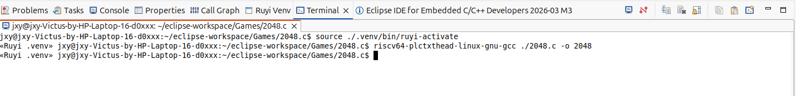
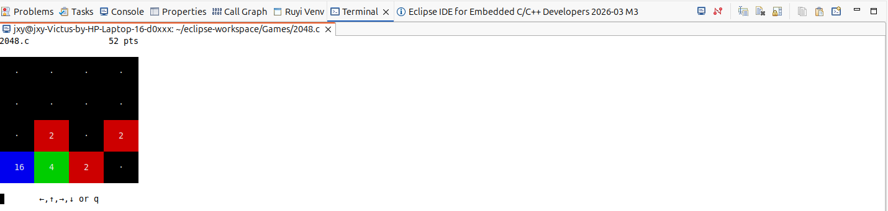
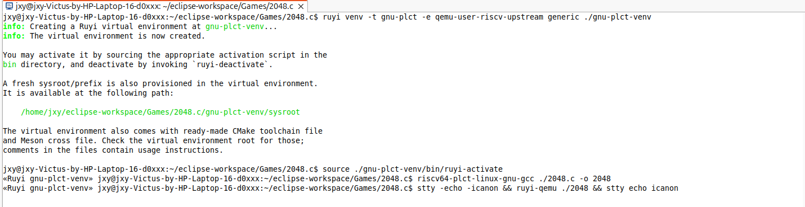

### 简介

2048.c 是经典 2048 游戏的 C 语言实现版本，本文详细介绍了通过 RuyiSDK 两种方式（可视化界面、命令行）创建适配的虚拟环境，完成 2048.c 项目的编译，并使用 QEMU 运行 riscv 架构可执行文件的完整流程，步骤清晰且可直接上手操作。

### 开始

- 获取项目

```
git clone https://github.com/mevdschee/2048.c.git
```

- 使用 Eclipse 打开项目： File -> Open Projects from File System...




### 创建虚拟环境到项目目录

#### 方式一：使用可视化界面

- RuyiSDK -> Venv -> New virtual environment...

- 勾选配置


- 选择虚拟环境路径，创建虚拟环境，名称为 .venv


- 打开终端，激活虚拟环境

```
source ./.venv/bin/ruyi-activate
```



- 编译 2048.c 生成可执行文件 2048

```
riscv64-plctxthead-linux-gnu-gcc ./2048.c -o 2048
```



- 使用 QEMU 运行构建出的程序

```
ruyi-qemu ./2048
```




#### 方式二：使用命令行

- 在项目路径下，在终端输入以下命令：

```
ruyi venv -t gnu-plct-xthead -e qemu-user-riscv-xthead sipeed-lpi4a ./sipeed-xthead-venv

source ./sipeed-xthead-venv/bin/ruyi-activate

riscv64-plctxthead-linux-gnu-gcc ./2048.c -o 2048

ruyi-qemu ./2048

```

- 尝试使用其他工具链

```
ruyi venv -t gnu-plct -e qemu-user-riscv-upstream generic ./gnu-plct-venv

source ./gnu-plct-venv/bin/ruyi-activate

riscv64-plct-linux-gnu-gcc ./2048.c -o 2048

stty -echo -icanon && ruyi-qemu ./2048 && stty echo icanon #修改终端模式
```




