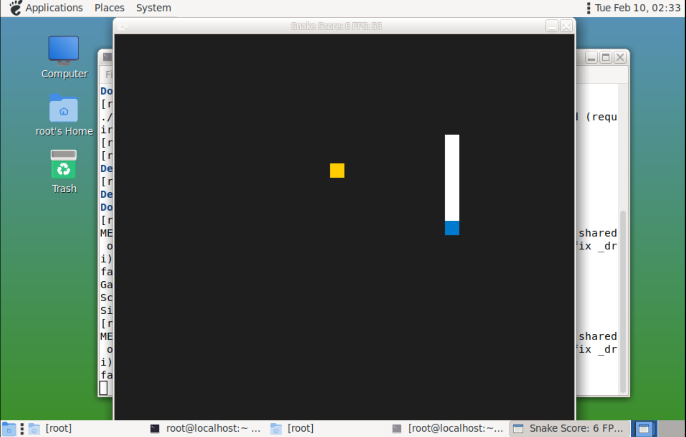

### 开始

- 获取项目

```
git clone https://github.com/udacity/CppND-Capstone-Snake-Game.git
```

- 使用 Eclipse 打开项目： File -> Open Projects from File System...


### 创建虚拟环境到项目目录

#### 方式一：使用可视化界面

- RuyiSDK -> Venv -> New virtual environment...

- 勾选配置


- 选择虚拟环境路径，创建虚拟环境，名称为 .venv


#### 方式二：使用命令行

- 在项目路径下，在终端输入以下命令：

```
ruyi venv -t gnu-plct-xthead -e qemu-user-riscv-xthead sipeed-lpi4a ./sipeed-xthead-venv

```

- 尝试使用其他工具链

```
ruyi venv -t gnu-plct -e qemu-user-riscv-upstream generic ./gnu-plct-venv

```

### 使用虚拟环境构建项目

- 向 sysroot 添加 SDL 依赖

```
#切换到虚拟环境目录
cd ~/eclipse-workspace/Games/CppND-Capstone-Snake-Game/gnu-plct-venv

# 创建目标目录（如果不存在）
mkdir -p sysroot/usr/include

# 从虚拟机拷贝整个 SDL2 文件夹
scp -P 12055 -r root@localhost:/usr/include/SDL2 ./sysroot/usr/include/ #拷贝头文件

# 从虚拟机拷贝相关的动态库文件
# 使用通配符 libSDL2* 来抓取主库及其软链接
scp -P 12055 -r root@localhost:/usr/lib64/libSDL2* ./sysroot/usr/lib64/ #拷贝库文件

```

- 处理软链接

```
cd ~/eclipse-workspace/Games/CppND-Capstone-Snake-Game/gnu-plct-venv/sysroot/usr/lib64

# 1. 删除被“硬拷贝”过来的冗余普通文件
rm libSDL2.so libSDL2-2.0.so.0

# 2. 创建运行时的软链接：指向真实的二进制文件
ln -s libSDL2-2.0.so.0.3000.0 libSDL2-2.0.so.0

# 3. 创建编译时的软链接：指向运行时的链接（或者直接指向原文件也可以）
ln -s libSDL2-2.0.so.0 libSDL2.so

```

- 从虚拟机拷贝 CMake 配置文件
```
cd ~/eclipse-workspace/Games/CppND-Capstone-Snake-Game/gnu-plct-venv

# 创建目标目录
mkdir -p sysroot/usr/lib64/cmake/SDL2

# 从虚拟机拷贝配置文件
scp -P 12055 -r root@localhost:/usr/lib64/cmake/SDL2/* ./sysroot/usr/lib64/cmake/SDL2/

```

- 对配置文件进行“路径修正”
```
# 1. 进入配置文件所在的实际目录
cd ~/eclipse-workspace/Games/CppND-Capstone-Snake-Game/gnu-plct-venv/sysroot.riscv64-plct-linux-gnu/usr/lib64/cmake/SDL2/

# 2. 将文件中所有的 "/usr" 替换为 "${CMAKE_SYSROOT}/usr"
# 这样 CMake 运行它时就会自动加上虚拟环境前缀
sed -i 's|"/usr|"${CMAKE_SYSROOT}/usr|g' sdl2-config.cmake

```

- 开始编译
```
cd ~/eclipse-workspace/Games/CppND-Capstone-Snake-Game

mkdir build && cd build

# 清理缓存（如果有）
rm -rf *

# 执行编译命令
cmake -DCMAKE_TOOLCHAIN_FILE=$HOME/eclipse-workspace/Games/CppND-Capstone-Snake-Game/gnu-plct-venv/toolchain.cmake \
      -DCMAKE_SYSROOT=$HOME/eclipse-workspace/Games/CppND-Capstone-Snake-Game/gnu-plct-venv/sysroot \
      ..

# 如果配置成功，直接 make
make

```
静态链接
```
# 清理缓存
rm -rf *

# 重新配置，增加静态链接参数
cmake -DCMAKE_TOOLCHAIN_FILE=$HOME/eclipse-workspace/Games/CppND-Capstone-Snake-Game/gnu-plct-venv/toolchain.cmake \
      -DCMAKE_SYSROOT=$HOME/eclipse-workspace/Games/CppND-Capstone-Snake-Game/gnu-plct-venv/sysroot \
      -DCMAKE_EXE_LINKER_FLAGS="-static-libstdc++ -static-libgcc" \
      ..

# 重新编译
make

```

- 虚拟机测试
```
# 产物传到虚拟机
scp -P 12055 SnakeGame root@localhost:/root/ 

```



