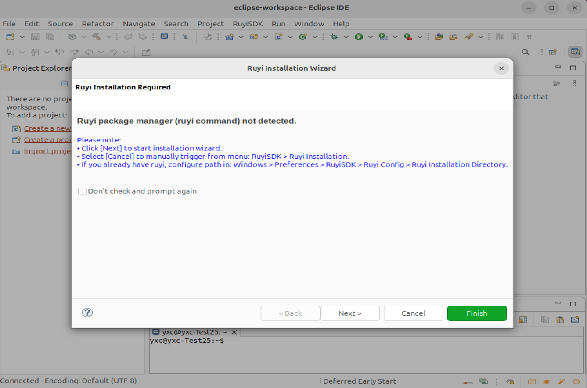
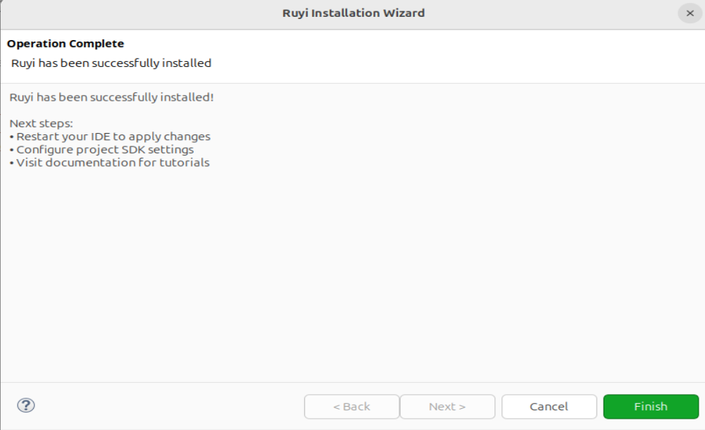

# 自动检测与安装ruyi

## 操作步骤

1. 确认未安装Ruyi或Ruyi版本低于最新版且Eclipse已安装插件
2. 打开Eclipse
3. 按照弹窗提示进行安装最新版ruyi

## 预期结果

启动自动检测，在插件安装完成后，若没有检测到 ruyi，会在主窗口弹出是否安装 ruyi 的选项提示安装,按照提示安装成功

## 测试结果

启动自动检测，在插件安装完成后，若没有检测到 ruyi，会在主窗口弹出是否安装 ruyi 的选项提示安装,按照提示安装成功

但在成功完成之前下一步按钮还是可以被点击，已提出 issue