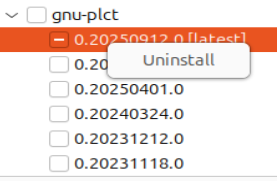
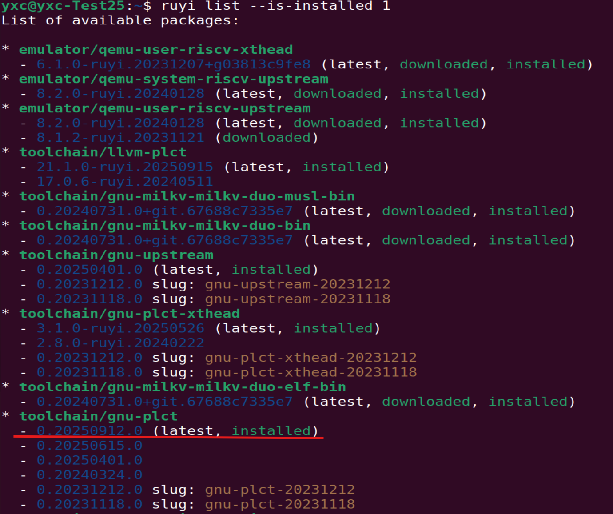
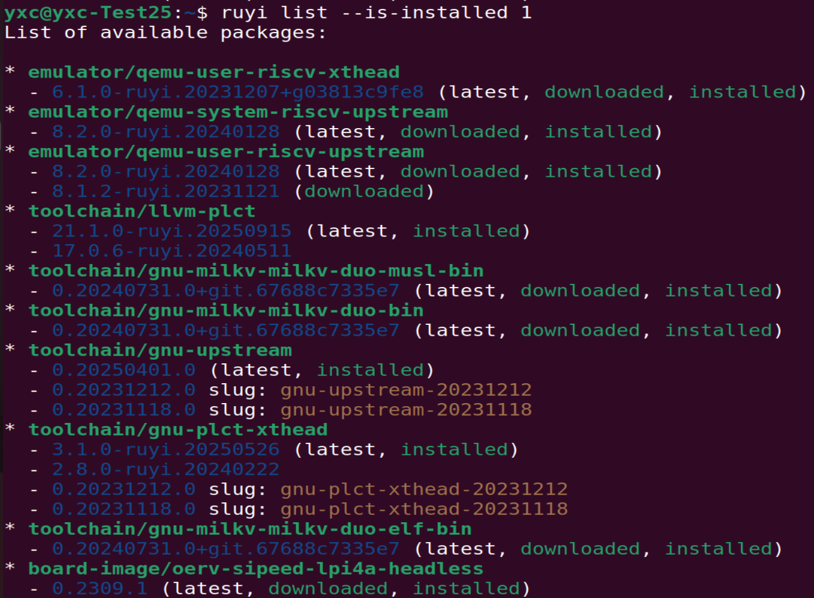

 移除包

## 操作步骤
1. 在底栏找到 Ruyi Package Explorer
2. 右键要删除的包选择uninstall
3. 点击Refresh List刷新列表
4. 对照命令行查看是否删除成功

## 预期结果

能够正常完成卸载，输出 RUYI_DONE

如需验证，可以执行 ~/.local/bin/ruyi list --is-installed 'y' --name-contains 'gnu-plct'

## 实际结果

能够正常完成卸载，输出 RUYI_DONE

