# 测试报告

版本 [7cd298b](https://github.com/ruyisdk/ruyisdk-eclipse-plugins/commit/7cd298ba0b7dfb557898560f59ecf027423577be)

## 总结

基础功能测试已覆盖。目前新闻显示及 venv 环境在特定条件下运行正常，但在安装向导逻辑、UI 交互（如按钮状态控制、窗口关闭逻辑）以及 venv 的自动检测机制上存在待优化问题。

共有 **4** 个 major 问题，**5** 个 minor 问题，**3** 个 consistency 问题。

## 详细说明

### 1. 安装时提示没有证书

> 严重度：minor

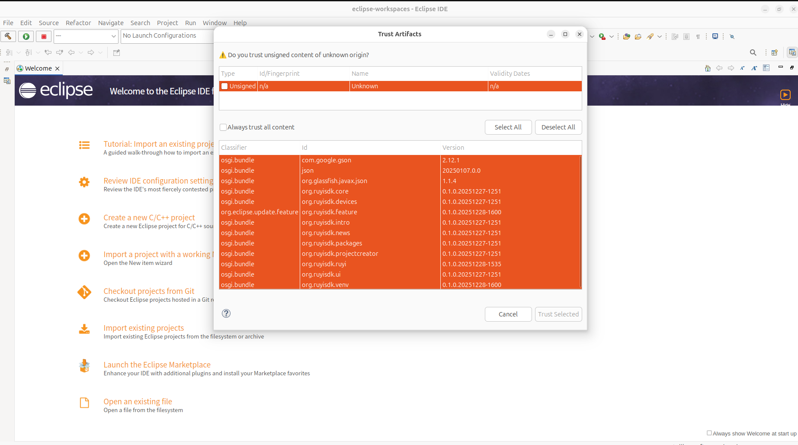

### 2. 安装 ruyi 时 Next，Finish 按钮没有被 disable

> 严重度：major

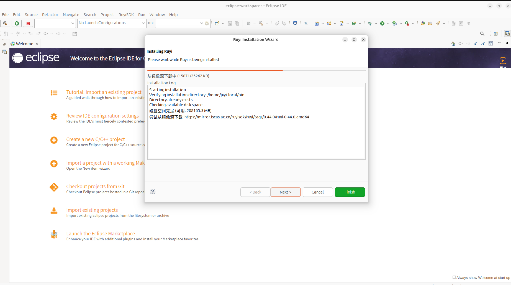

### 3. 新闻

> pass

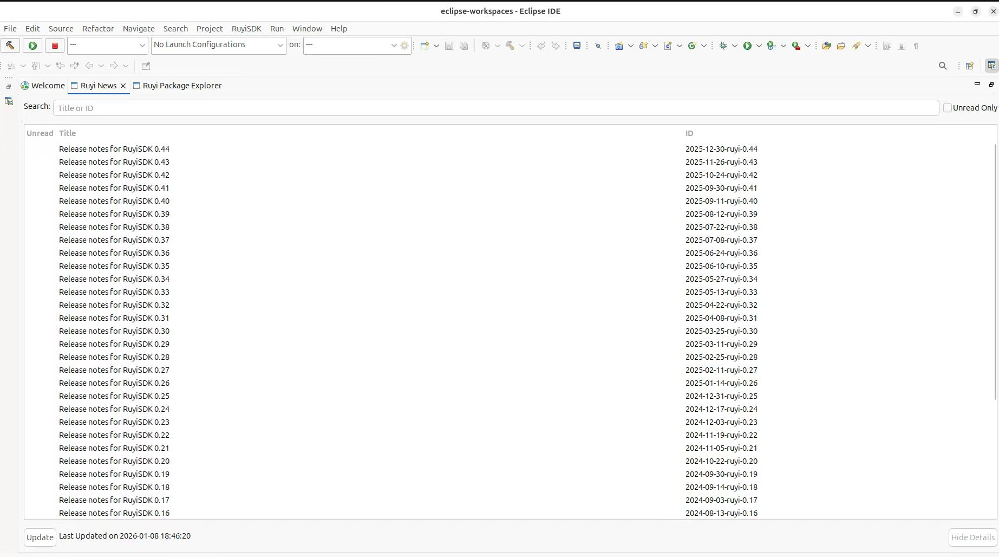

### 4. Ruyi Package Explorer 不易被找到

> 严重度：consistency

首先要在 IDE 的 window -> Show View -> Other... 里面打开 Show View 窗口。

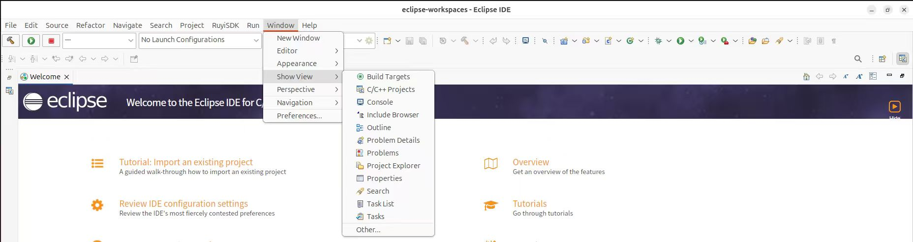

然后找到 RuyiSDK 才能打开 Ruyi Package Explorer。

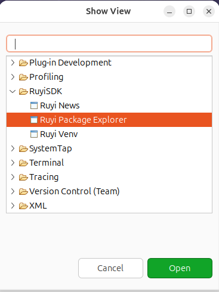 

### 5. 选择开发板时没有 sort

> 严重度：consistency

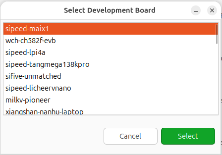 

### 6. 下载 package 的 UI 中 OK 没有被 disable

> 严重度：major

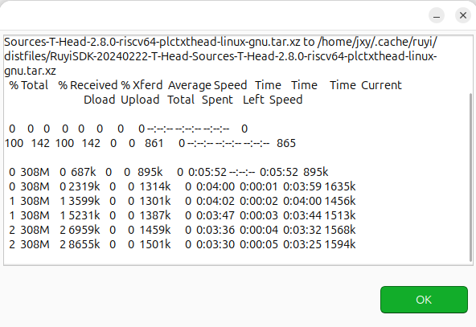 

### 7. 下载 package 的 UI 中点击 window close 后台仍在下载

> 严重度：major

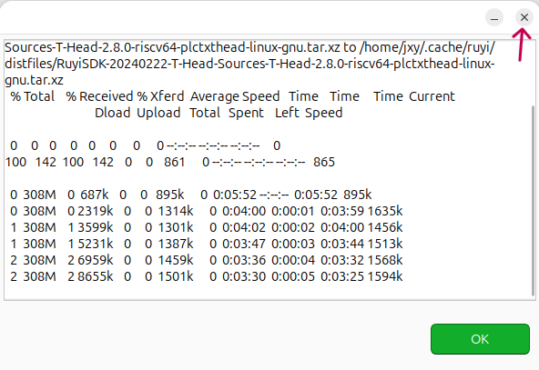 

后台仍在下载：

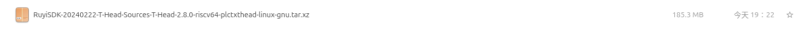
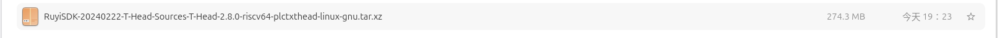
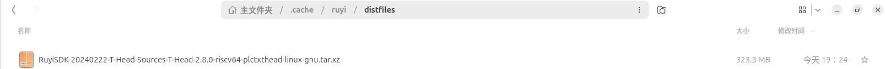

并且 extracting 成功：

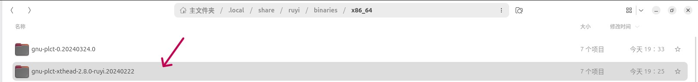

### 8. 下载 package 的 UI 刷 log

> 严重度：minor

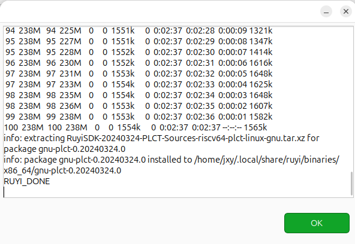 

### 9. package 的卸载按钮不好被找到

> 严重度：minor

需要点击已经下载的包然后右键进行删除：

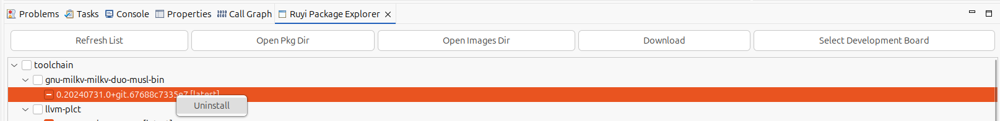

### 10. 配置 venv 时报错窗口文本框控件大小没有自适应

> 严重度：consistency

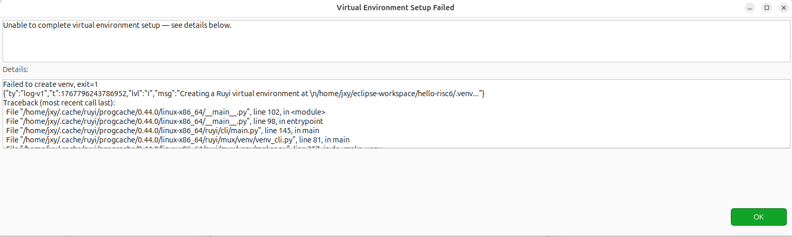

界面放大后：

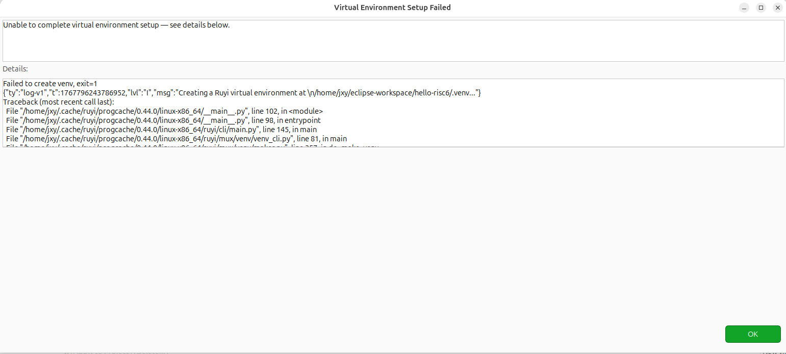

### 11. venv 不检测当前目录，只能写在项目根目录才会被检测到

> 严重度：major

初始状态：

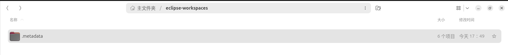
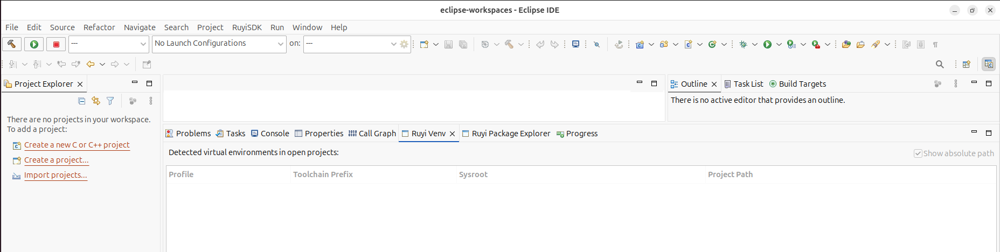

创建虚拟环境：

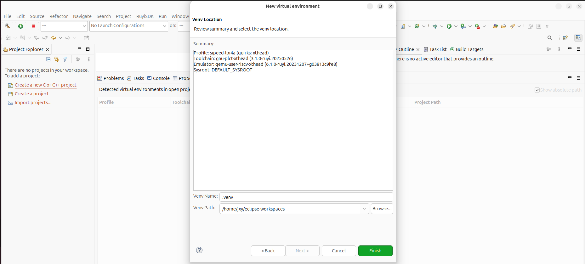

环境创建成功：

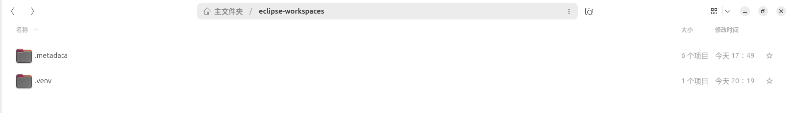

并未检测到：

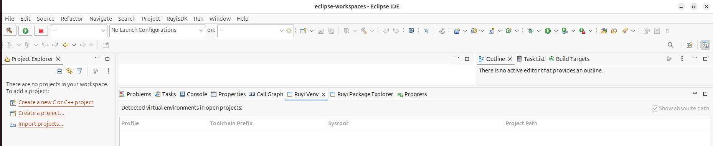

创建新项目：hello-risc1，在项目根目录下创建虚拟环境，成功检测到：

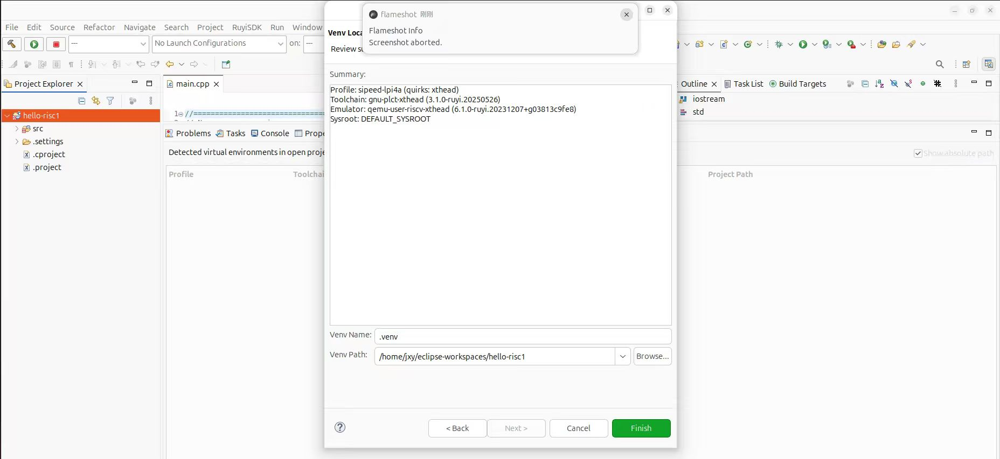
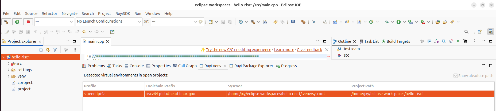

### 12. venv 项目在删除时不刷新，重启 Ruyi Venv 窗口，成功刷新

> 严重度：minor

删除hello-risc1项目，虚拟环境还显示“存在”：

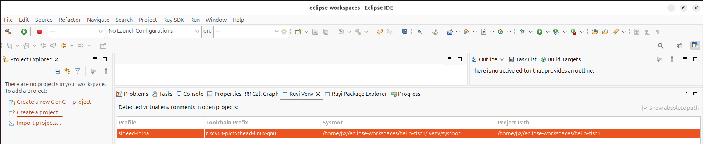

重启窗口后刷新成功：

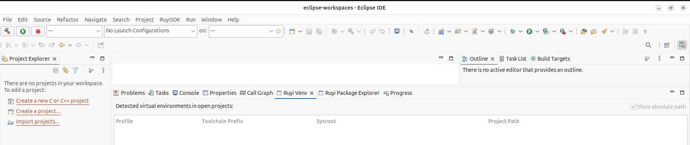

### 13. 使用 venv 运行项目

> pass

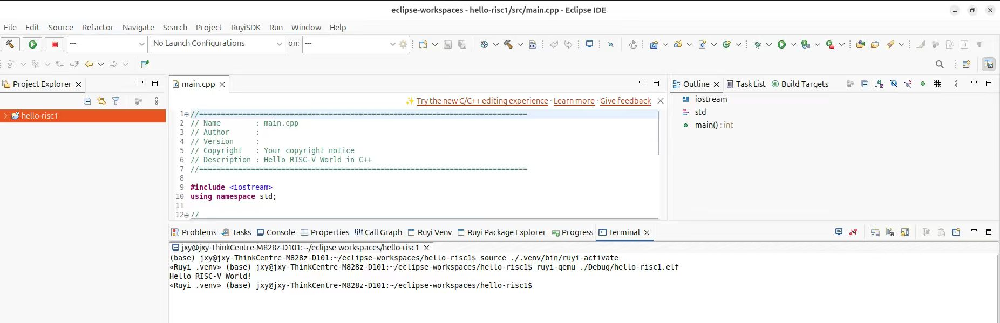

### 14. 开发板设置没有被 package 引用，显得 pointless

> 严重度：minor

//need verify

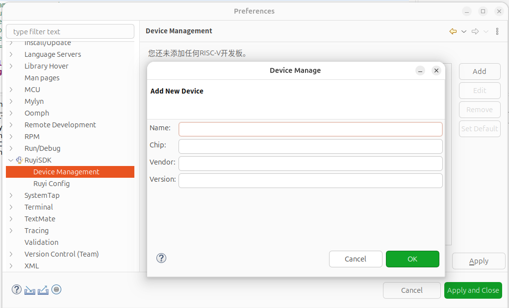 

