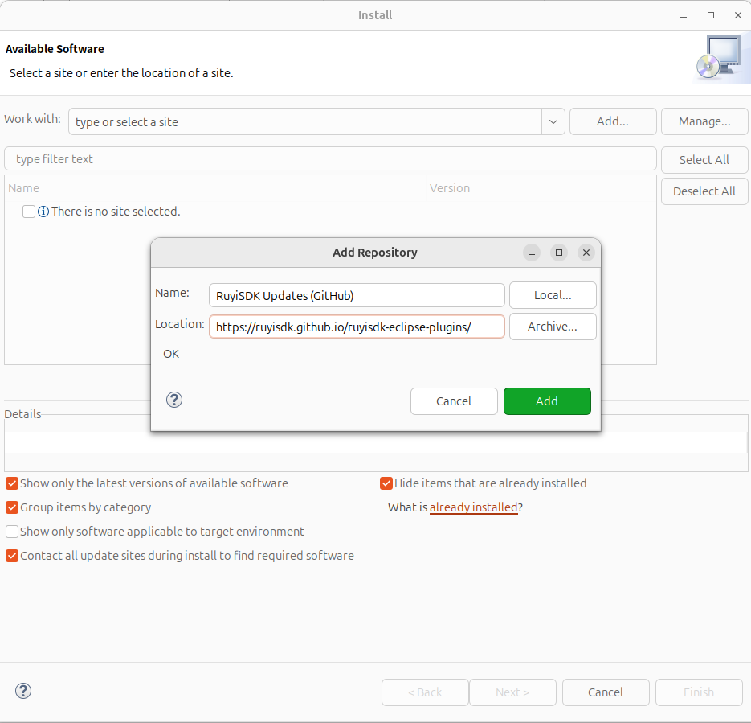
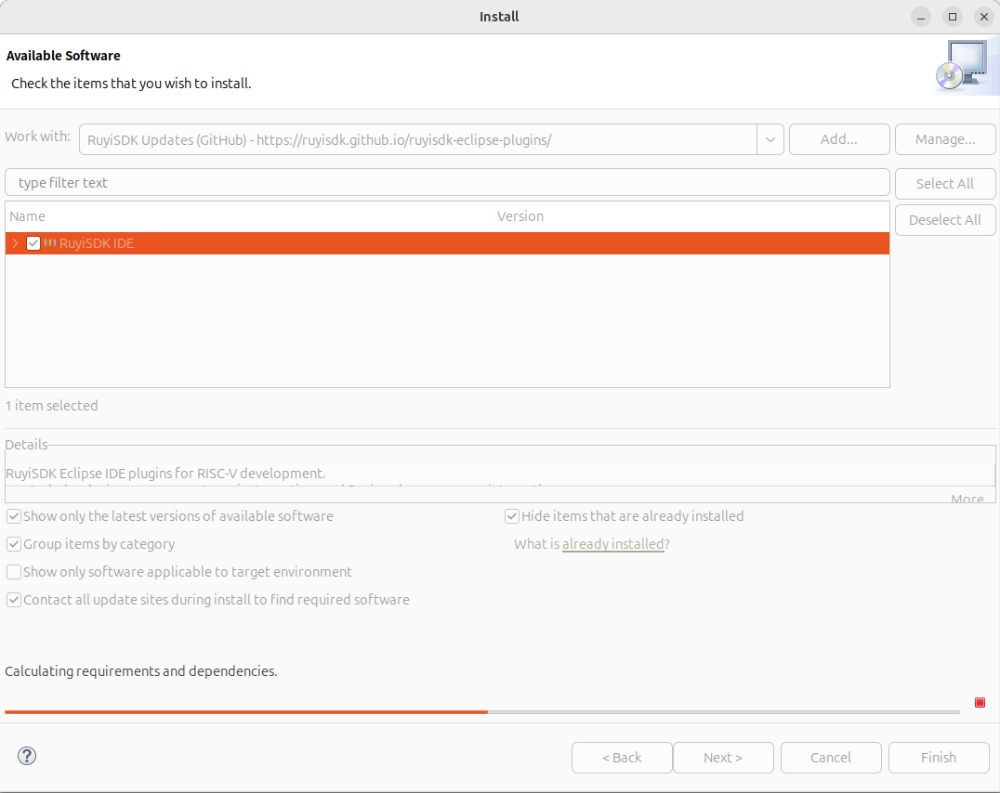
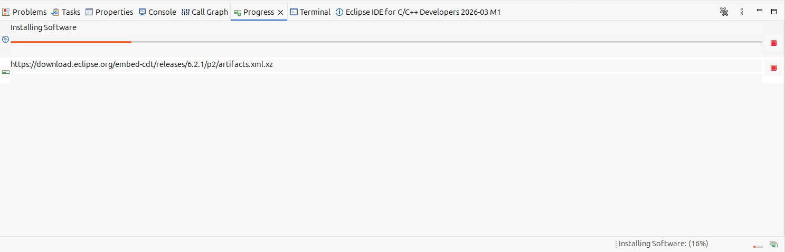
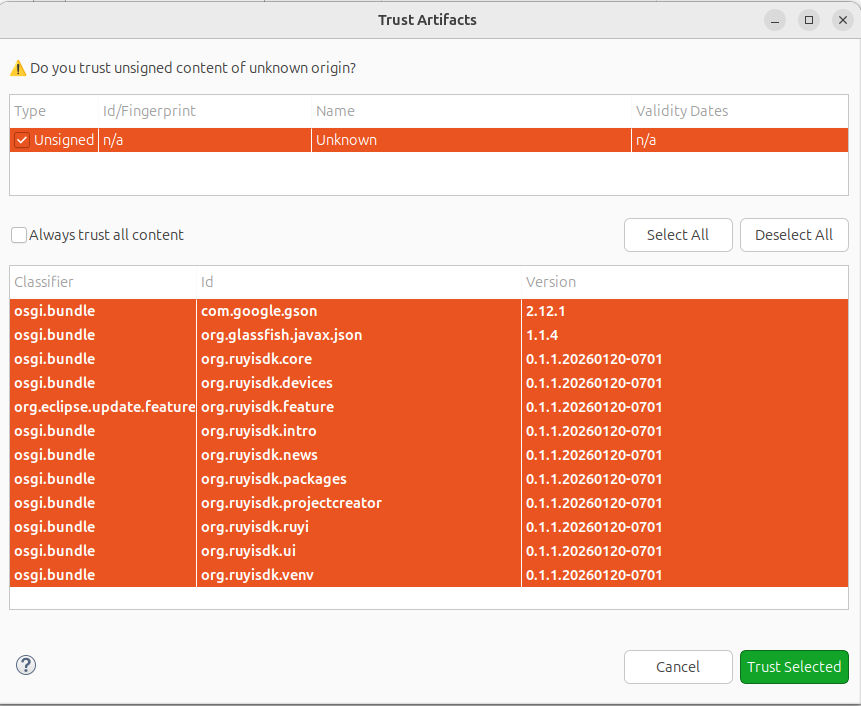
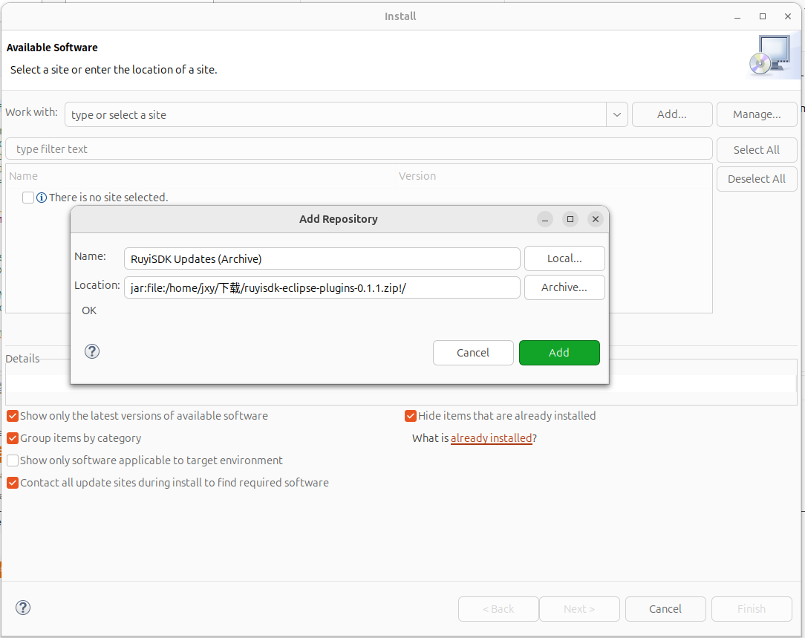
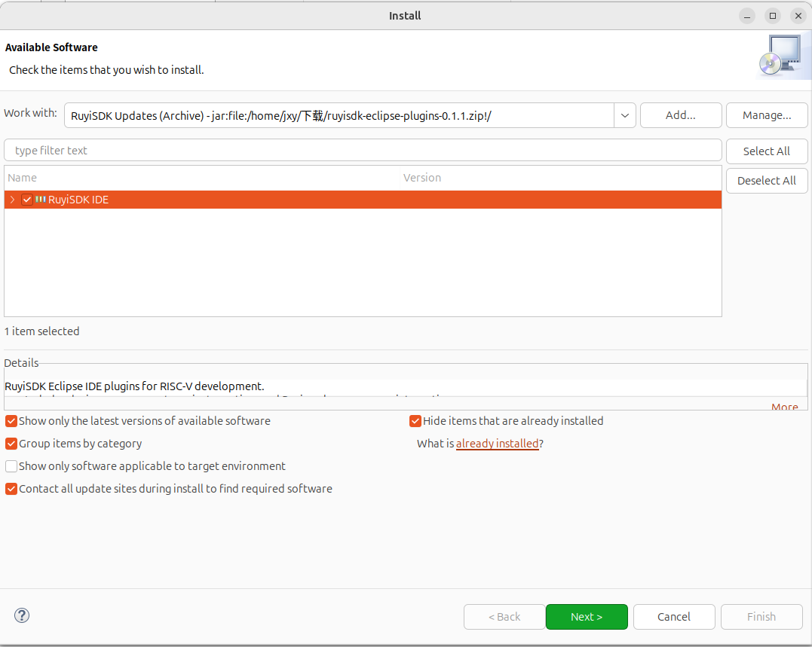
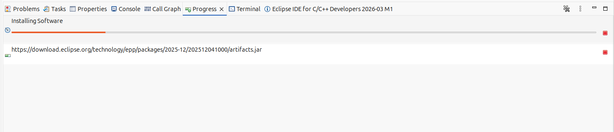
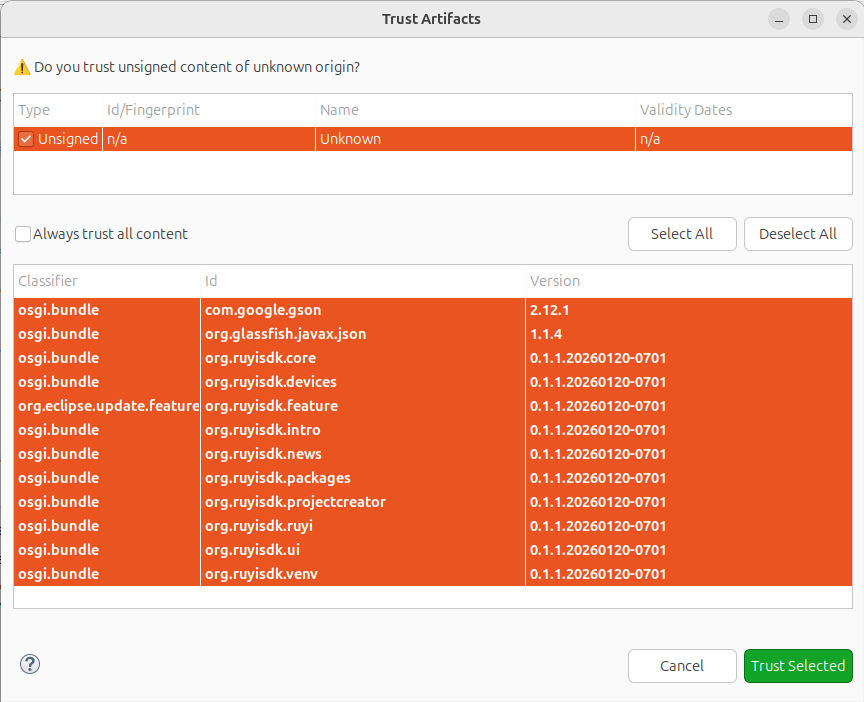

# 安装插件

## 操作步骤

1.使用 [ruyisdk-eclipse-plugins/releases](https://github.com/ruyisdk/ruyisdk-eclipse-plugins/releases) 提供的方法进行操作，分为在线安装和离线安装两种方式。

## 预期结果

使用在线安装和离线安装这两种方式都能够正常安装，无报错。

## 测试结果

能够正常安装，无报错。

- 在线安装

- 离线安装

