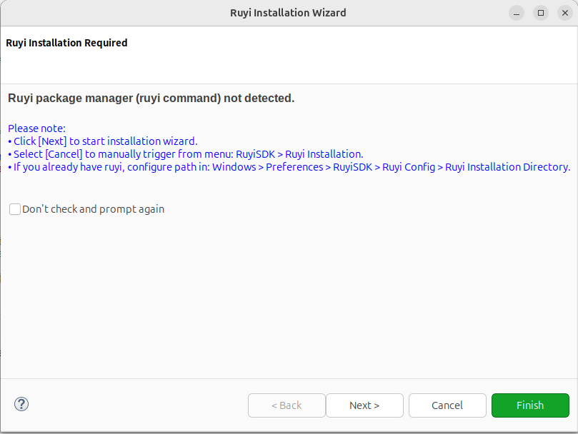
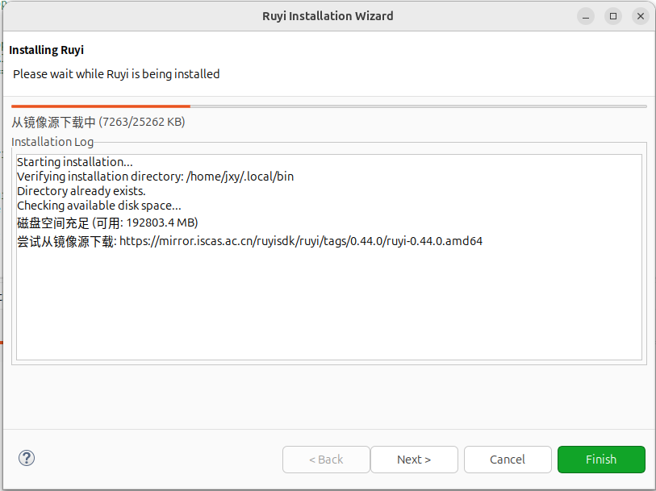
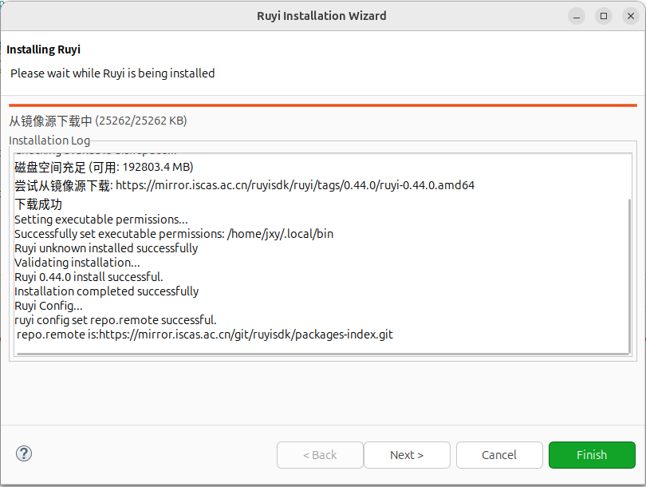
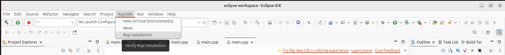
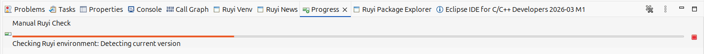

# 自动检测与安装ruyi

## 操作步骤

1. Eclipse 已安装 RuyiSDK 插件。
2. 重启/打开 Eclipse，等待自动检测。
3. 手动检测 ruyi 环境，点击 RuyiSDK -> Ruyi Installation 检测ruyi环境。

## 预期结果
1. 重启/打开 Eclipse，自动检测 ruyi 是否安装，若未安装 ruyi 按照弹窗提示进行安装最新版 ruyi，若已安装 ruyi，无报错。
2. 手动检测 ruyi 环境，点击 RuyiSDK -> Ruyi Installation，成功检测ruyi环境，并不报异常。

## 测试结果

自动检测符合预期，手动 RuyiSDK -> Ruyi Installation 测试正常，但未安装 ruyi 时，下载过程中 Next 和 Finish 按钮未 disable。

- 自动检测

下载过程中 Next 和 Finish 按钮未 disable

- 手动检测

