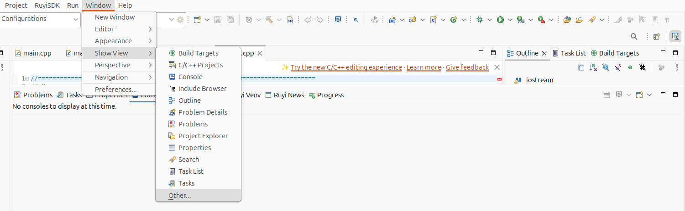
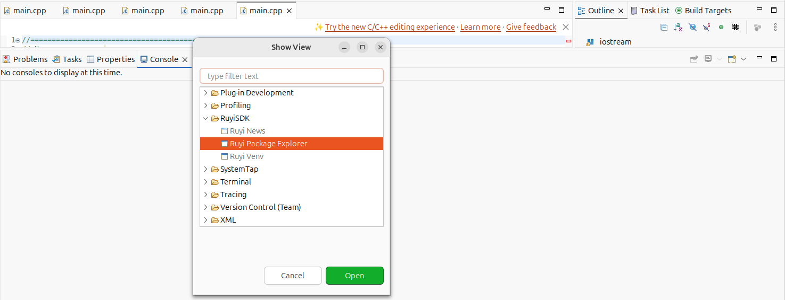
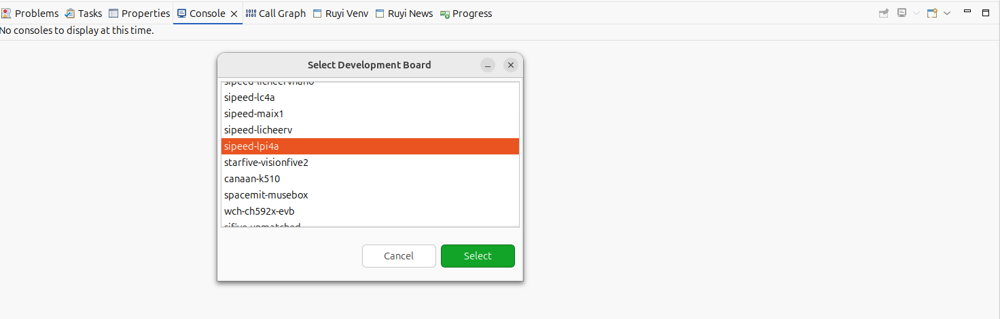
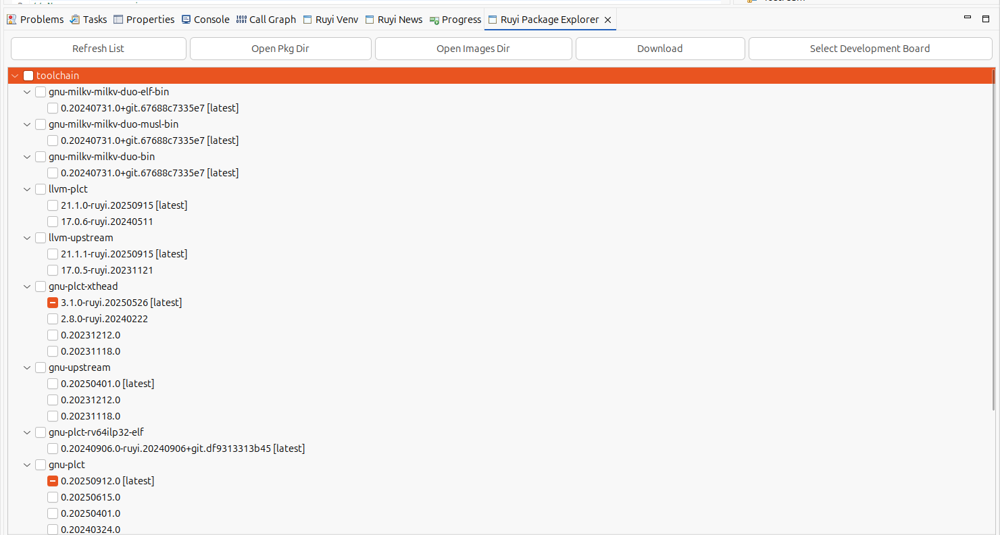
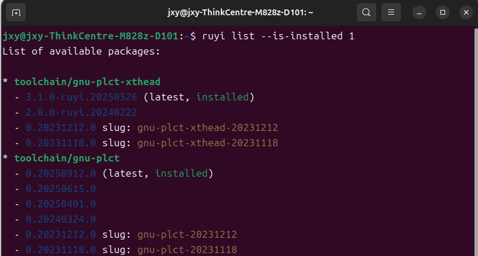
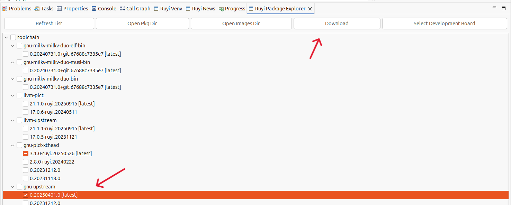
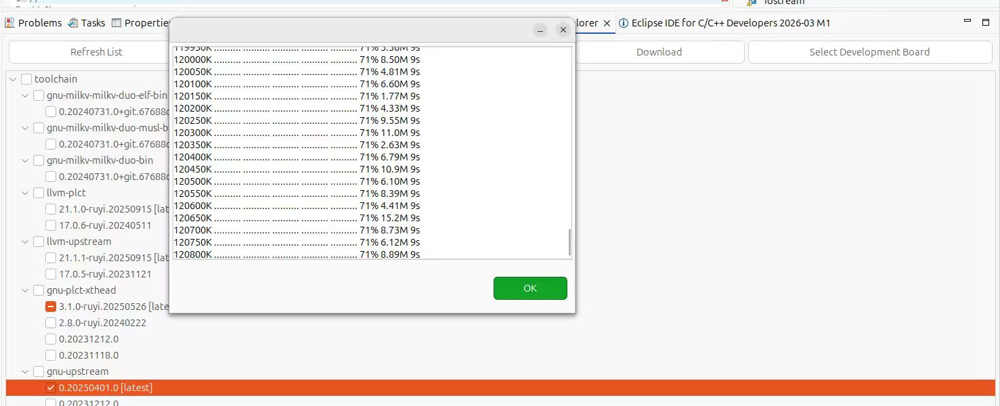
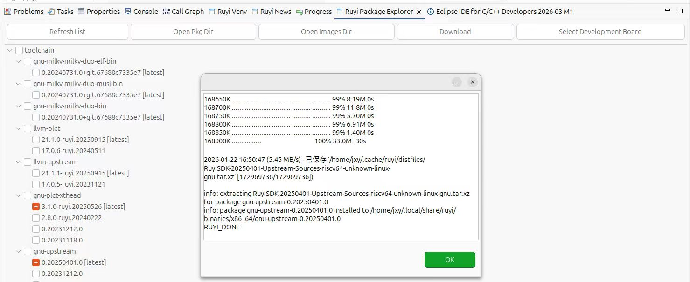
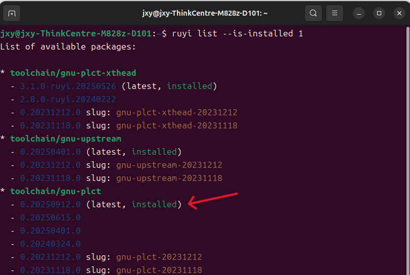

# 安装包

## 操作步骤

1. 点击Window -> Show View -> Other -> RuyiSDK -> Ruyi Package Explorer进入包管理器。
3. 选择需要安装的包后点击 Download。
4. 命令行和视图同步查看安装情况。

## 预期结果
1. 成功完成安装，输出 `RUYI_DONE`。

2. 命令行执行 `~/.local/bin/ruyi list --is-installed 1`，显示Install的包。

## 实际结果

能够正常安装包。
- 打开包管理器

- 选择开发板

- 包管理器界面

- 命令行查看已安装的包

- 选择包并安装

- Ruyi Package Explorer 显示安装成功

- 使用命令行验证安装成功

