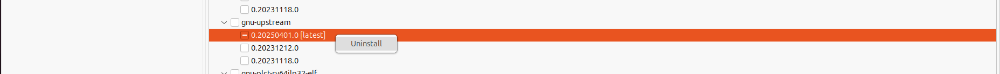
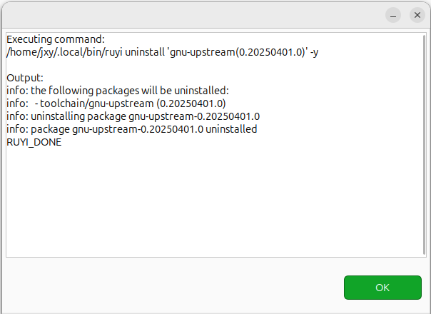
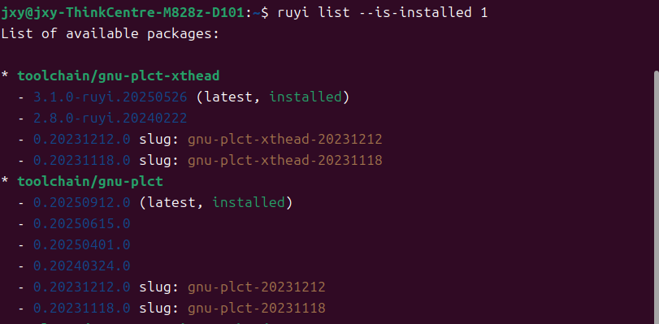

 移除包

## 操作步骤
1. 在底栏找到 Ruyi Package Explorer。
2. 右键要删除的包选择 Uninstall。
3. 对照命令行查看是否删除成功。

## 预期结果

1. 成功完成卸载，输出 `RUYI_DONE`。

2. 命令行执行 `~/.local/bin/ruyi list --is-installed 1`，包列表完成删除更新。

## 实际结果

能够正常完成卸载，输出 RUYI_DONE。
- 右键要删除的包点击 Uninstall

- Ruyi Package Explorer 显示删除成功

- 使用命令行验证删除成功

