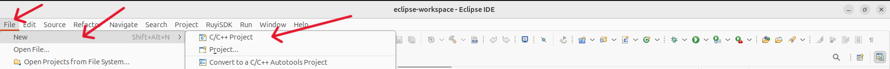
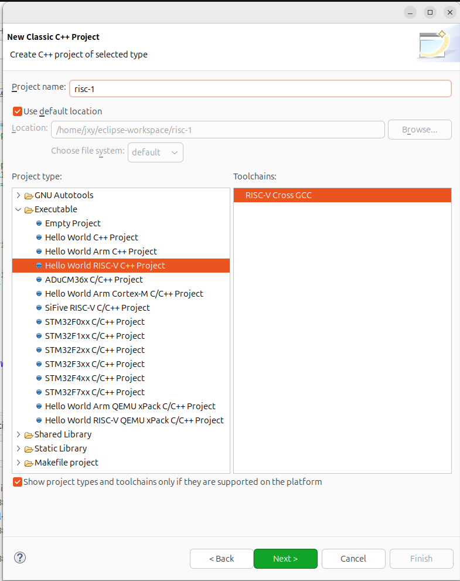
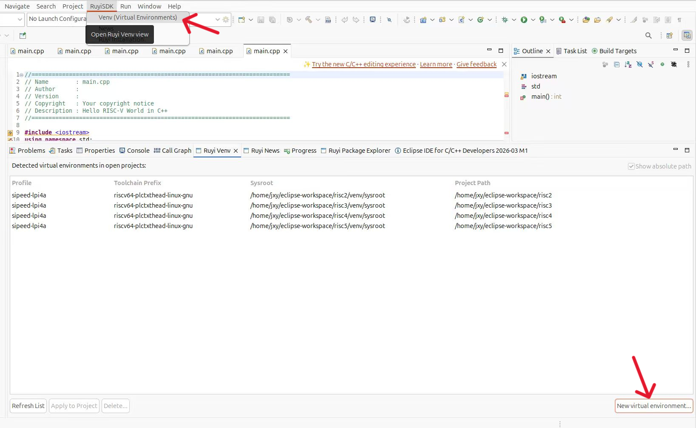
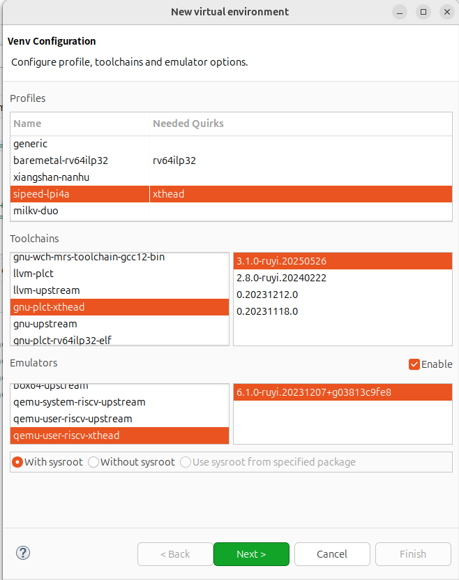
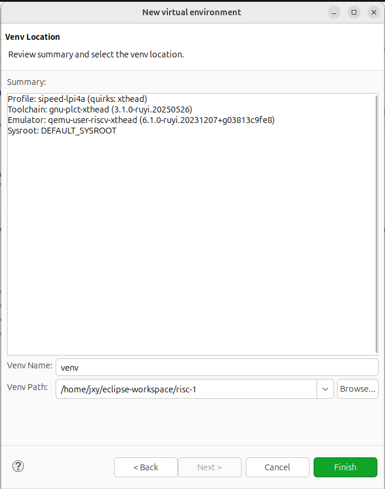
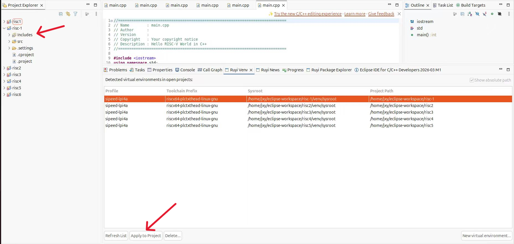
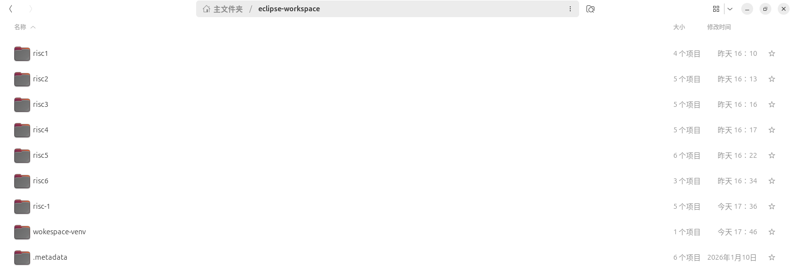
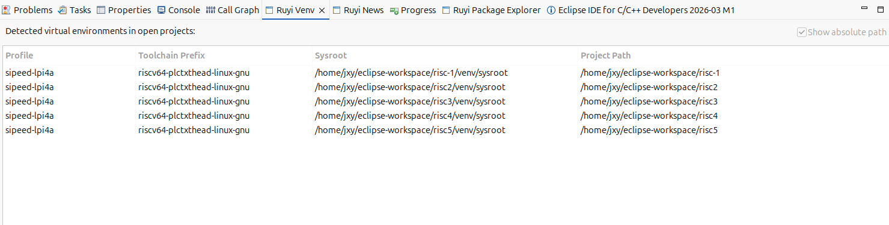
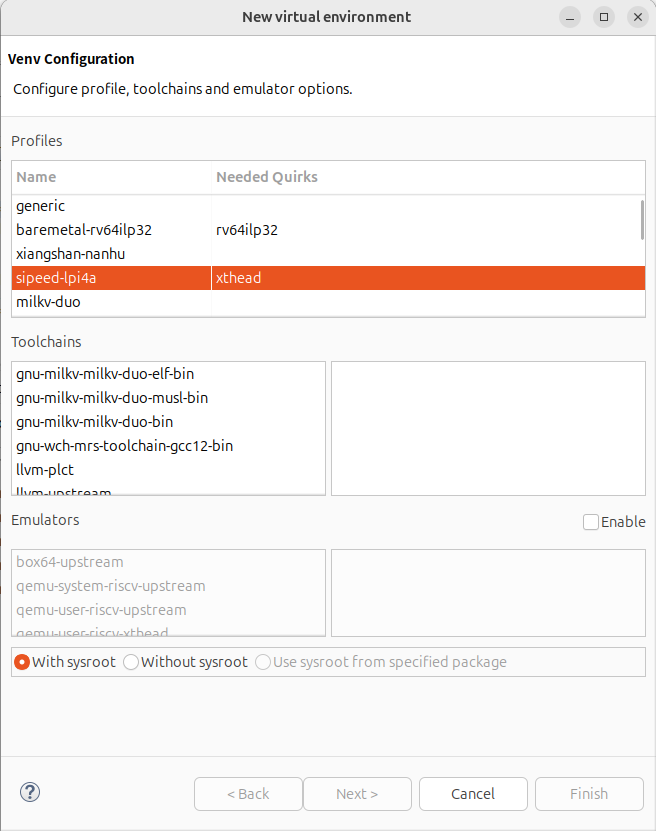
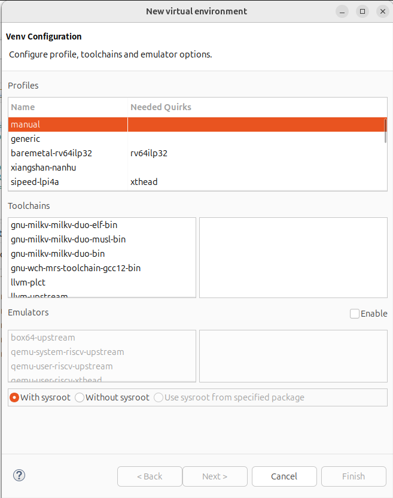

# 创建虚拟环境并应用到项目

## 操作步骤

1. 打开或创建一个项目。
2. 菜单栏点击 RuyiSDK -> Venv(Virtual Environments)。
3. 创建新的虚拟环境。
4. 点击 Apply to Project 应用。
## 预期结果

可以正常进行创建虚拟环境并应用到项目。
## 实际结果

可以正常进行创建虚拟环境并应用到项目。

- 创建项目

- 创建虚拟环境

- Apply to Project

bug1：创建虚拟环境时选择的路径若不在项目目录下则无法成功应用并显示

bug2：创建虚拟环境时 profile 列表的排序不一致

