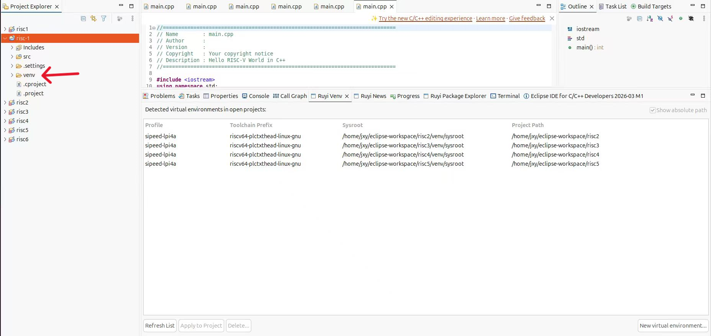

# 虚拟环境删除后项目目录更新

## 操作步骤
1. 选中Ruyi Venv中的虚拟环境。
2. 点击Ruyi Venv中的Delete按钮。
3. 确认删除。
## 预期结果

虚拟环境删除后，项目文件列表中的虚拟环境目录同步删除。

## 实际结果

虚拟环境删除后，项目文件列表中的虚拟环境目录仍显示存在，要手动刷新。

- 删除虚拟环境

虚拟环境存放目录仍存在

- 手动刷新，虚拟环境目录消失

