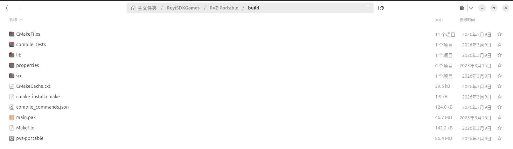
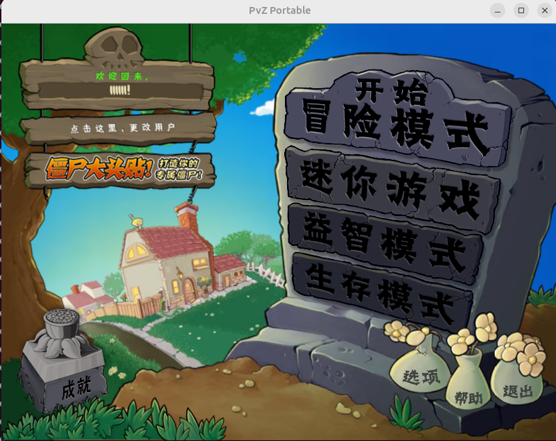

使用 ruyisdk 创建虚拟环境编译并游玩 PVZ

## 开始

获取项目:
```
git clone https://github.com/wszqkzqk/PvZ-Portable.git

cd PvZ-Portable
```
## 创建虚拟环境
- 在项目路径下，在终端输入以下命令：

```
ruyi venv -t gnu-plct -e qemu-user-riscv-upstream generic ./gnu-plct-venv
```

## 制作 sysroot
- 由于游戏项目需要依赖 SDL_mixer，SDL_ttf，SDL_image等，现在需要重新配置虚拟环境下的 sysroot，参照：
[配置sysroot](https://github.com/jxy687/Docs/blob/main/Shooter-ruyisdk.cn/main.md)

### 项目还依赖 libopenmpt-dev，现在手动配置：

```
# 下载当前的稳定版压缩包
wget https://lib.openmpt.org/files/libopenmpt/src/libopenmpt-0.7.3+release.autotools.tar.gz

# 解压
tar -zxvf libopenmpt-0.7.3+release.autotools.tar.gz
cd libopenmpt-0.7.3+release.autotools
```
```
# 虚拟环境的工具链前缀
export CROSS_COMPILE=/home/jxy/RuyiSDKGames/PvZ-Portable/gnu-plct-venv/bin/riscv64-plct-linux-gnu-

# 虚拟环境的sysroot 路径
export TARGET_SYSROOT=/home/jxy/RuyiSDKGames/PvZ-Portable/gnu-plct-venv/sysroot

# 指定编译器
export CC="${CROSS_COMPILE}gcc --sysroot=${TARGET_SYSROOT}"
export CXX="${CROSS_COMPILE}g++ --sysroot=${TARGET_SYSROOT}"

```
```
./configure \
    --host=riscv64-plct-linux-gnu \
    --prefix=${TARGET_SYSROOT}/usr \
    --libdir=${TARGET_SYSROOT}/usr/lib64 \
    --disable-shared \
    --enable-static \
    --disable-examples \
    --disable-openmpt123 \
    --disable-tests \
    --without-mpg123 \
    --without-ogg \
    --without-vorbis \
    --without-vorbisfile \
    --without-zlib \
    --without-sdl2
# 编译
make -j$(nproc)

# 安装到 sysroot
make install
```

## 编译并运行项目
进入项目目录
### 编译
```
mkdir build && cd build
# 先回到上一级
cd ..
# 直接构建
cmake -S . -B build \
      -DCMAKE_TOOLCHAIN_FILE=$PWD/gnu-plct-venv/toolchain.cmake \
      -DCMAKE_SYSROOT=$PWD/gnu-plct-venv/sysroot \
      -DCMAKE_EXE_LINKER_FLAGS="-static-libstdc++ -static-libgcc" \
      -DCMAKE_C_FLAGS="-std=gnu11"

cd ./build && make
```
### 运行
由于版权原因，作者并未提供游戏所需的 main.pak 和 properties 文件夹，可访问[配置文件](https://github.com/jxy687/Docs/tree/main/PVZ/file)进行下载并移动到build目录下：



```
# 激活虚拟环境
source ./gnu-plct-venv/bin/ruyi-activate

cd ..

# 运行游戏
env SDL_AUDIODRIVER=dummy LIBGL_ALWAYS_SOFTWARE=1 ruyi-qemu -L $PWD/gnu-plct-venv/sysroot ./build/pvz-portable
```
