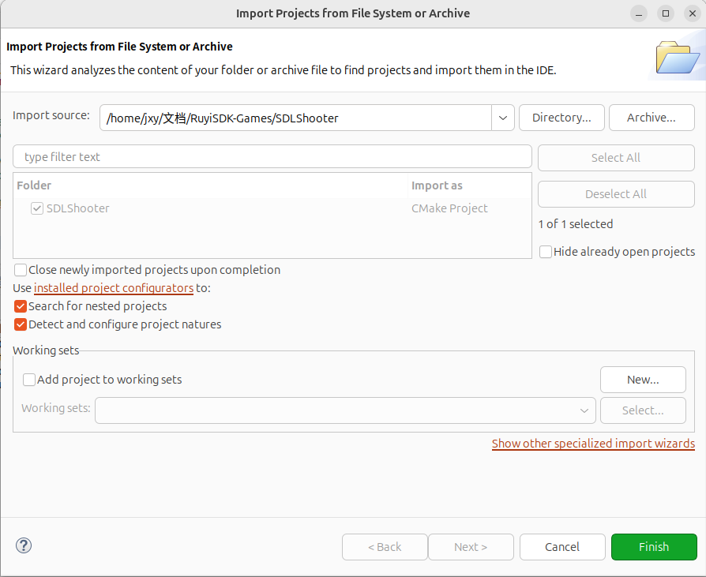
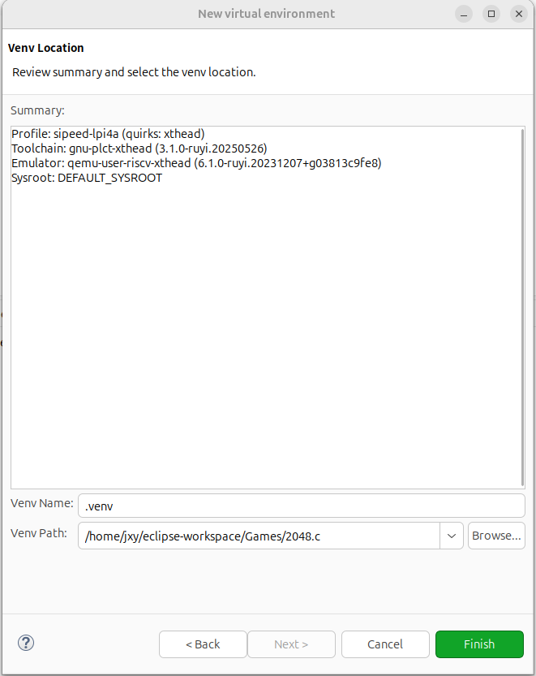
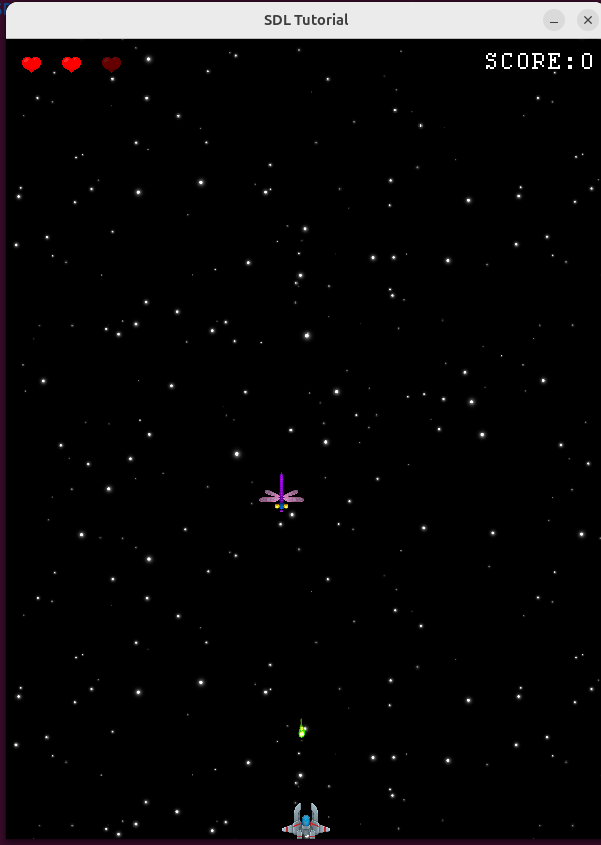

### 开始

获取项目
```
git clone https://github.com/WispSnow/SDLShooter.git
```
使用 Eclipse 打开项目： File -> Open Projects from File System...



### 创建虚拟环境到项目目录

#### 方式一：使用可视化界面

- RuyiSDK -> Venv -> New virtual environment...

- 勾选配置


- 选择虚拟环境路径，创建虚拟环境，名称为 .venv



#### 方式二：使用命令行

- 在项目路径下，在终端输入以下命令：

```
ruyi venv -t gnu-plct-xthead -e qemu-user-riscv-xthead sipeed-lpi4a ./sipeed-xthead-venv

```

- 尝试使用其他工具链

```
ruyi venv -t gnu-plct -e qemu-user-riscv-upstream generic ./gnu-plct-venv

```
### 移植 sysroot
如果你有 RISC-V openEuler，比如使用QEMU，并且依赖充足

在项目目录下创建虚拟环境（已经创建不用二次创建）
```
ruyi venv -t gnu-plct -e qemu-user-riscv-upstream generic ./gnu-plct-venv

```
向虚拟环境下的 sysroot 移植相关依赖
```
# 同步常用运行时库和用户空间（保留符号链接/权限/ACL/xattrs）
rsync -aHAX --numeric-ids -e "ssh -p 12055" \
  root@localhost:/usr/include/ \
  ./gnu-plct-venv/sysroot/usr/include/

rsync -aHAX --numeric-ids -e "ssh -p 12055" \
  root@localhost:/lib/ \
  ./gnu-plct-venv/sysroot/lib/

rsync -aHAX --numeric-ids -e "ssh -p 12055" \
  root@localhost:/lib64/ \
  ./gnu-plct-venv/sysroot/lib64/

rsync -aHAX --numeric-ids -e "ssh -p 12055" \
  root@localhost:/usr/lib/ \
  ./gnu-plct-venv/sysroot/usr/lib/

rsync -aHAX --numeric-ids -e "ssh -p 12055" \
  root@localhost:/usr/lib64/ \
  ./gnu-plct-venv/sysroot/usr/lib64/

# 可选：同步 /usr/bin, /usr/sbin（某些 helper 程序可能需要）
rsync -aHAX --numeric-ids -e "ssh -p 12055" \
  root@localhost:/usr/bin/ \
  ./gnu-plct-venv/sysroot/usr/bin/

rsync -aHAX --numeric-ids -e "ssh -p 12055" \
  root@localhost:/usr/sbin/ \
  ./gnu-plct-venv/sysroot/usr/sbin/

```
修改配置文件
```
cd ./gnu-plct-venv/sysroot

find usr/lib64/cmake -name "*.cmake" -exec sed -i 's|"/usr|"${CMAKE_SYSROOT}/usr|g' {} +
```
激活虚拟环境
```
source ./gnu-plct-venv/bin/ruyi-activate
```
编译项目
```
mkdir build && cd build

cmake -DCMAKE_TOOLCHAIN_FILE=$HOME/RuyiSDKGames/SDLShooter/gnu-plct-venv/toolchain.cmake \
      -DCMAKE_SYSROOT=$HOME/RuyiSDKGames/SDLShooter/gnu-plct-venv/sysroot \
      -DCMAKE_EXE_LINKER_FLAGS="-static-libstdc++ -static-libgcc" \
      ..

make
```
运行项目
```
cd ..

env SDL_AUDIODRIVER=dummy LIBGL_ALWAYS_SOFTWARE=1 ruyi-qemu -L ~/RuyiSDKGames/SDLShooter/gnu-plct-venv/sysroot/ ./build/SDLShooter-Linux
```


### 无法移植就手动制作 sysroot
Ubuntu 上安装必要依赖并初始化 sysroot
```
sudo apt install -y qemu-user-static dnf

mkdir -p ~/oe-sysroot/usr/bin
sudo cp /usr/bin/qemu-riscv64-static ~/oe-sysroot/usr/bin/

sudo dnf --installroot=$HOME/oe-sysroot \
           --forcearch=riscv64 \
           --releasever=24.03 \
            --repofrompath=oe-base,https://mirrors.huaweicloud.com/openeuler/openEuler-24.03-LTS/OS/riscv64/ \
            --repofrompath=oe-update,https://mirrors.huaweicloud.com/openeuler/openEuler-24.03-LTS/update/riscv64/ \
            --disablerepo=* --enablerepo=oe-base,oe-update \
            --nogpgcheck \
            --setopt=install_weak_deps=False \
            install -y bash coreutils dnf openEuler-release

sudo cp /etc/resolv.conf ~/oe-sysroot/etc/resolv.conf
```
进入 openEuler 安装依赖
```
sudo chroot ~/oe-sysroot /bin/bash

dnf install SDL2-devel freetype-devel libpng-devel wavpack-devel mesa-dri-drivers mesa-libGL-devel libX11-devel zlib-devel openssl-devel libXext-devel libXcursor-devel libXinerama-devel libXi-devel fluidsynth-devel opus-devel opusfile-devel libogg-devel wavpack-devel freetype-devel libpng-devel libjpeg-turbo-devel libwebp-devel libtiff-devel SDL2-static glibc-devel

dnf groupinstall -y "Development Tools"
```
手动编译一些依赖,以 libxmp 为例，其余还有（SDL2_mixer，SDL2_ttf，SDL2_image）
```
mkdir PkgDownload && cd PkgDownload
# 克隆 libxmp 源码
git clone https://github.com/libxmp/libxmp.git
cd libxmp

mkdir build && cd build
cmake .. -DCMAKE_INSTALL_PREFIX=/usr
make -j$(nproc)
make install
ldconfig
```
完成后
```
exit
```
建立软链接
```
sudo chown -R $USER:$USER ~/oe-sysroot

cd ~/oe-sysroot
sudo ln -s usr/lib64 lib
sudo ln -s lib64 usr/lib
sudo ln -s ~/oe-sysroot/usr/lib64/dri ~/oe-sysroot/lib64/dri

```
更改配置文件
```
cd ~/oe-sysroot

find usr/lib64/cmake -name "*.cmake" -exec sed -i 's|"/usr|"${CMAKE_SYSROOT}/usr|g' {} +
```
激活虚拟环境
```
source ./gnu-plct-venv/bin/ruyi-activate
```
```
nano toolchain.cmake
```
toolchain.cmake中填入
```
set(CMAKE_SYSTEM_NAME Linux)
set(CMAKE_SYSTEM_PROCESSOR riscv64)

set(CMAKE_C_COMPILER "riscv64-plct-linux-gnu-gcc")
set(CMAKE_CXX_COMPILER "riscv64-plct-linux-gnu-g++")

set(CMAKE_SYSROOT "/home/jxy/oe-sysroot")

set(CMAKE_FIND_ROOT_PATH "/home/jxy/oe-sysroot")
set(CMAKE_FIND_ROOT_PATH_MODE_PROGRAM NEVER)
set(CMAKE_FIND_ROOT_PATH_MODE_LIBRARY ONLY)
set(CMAKE_FIND_ROOT_PATH_MODE_INCLUDE ONLY)
set(CMAKE_FIND_ROOT_PATH_MODE_PACKAGE ONLY)
```
编译项目
```
mkdir build && cd build

cmake -DCMAKE_TOOLCHAIN_FILE=$PWD/../toolchain.cmake \
      -DCMAKE_SYSROOT=$HOME/oe-sysroot \
      -DCMAKE_EXE_LINKER_FLAGS="-static-libstdc++ -static-libgcc" \
      ..

make
```
运行项目
```
cd ..

env SDL_AUDIODRIVER=dummy LIBGL_ALWAYS_SOFTWARE=1 ruyi-qemu -L ~/oe-sysroot ./build/SDLShooter-Linux
```
