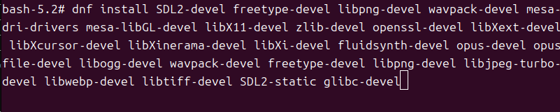
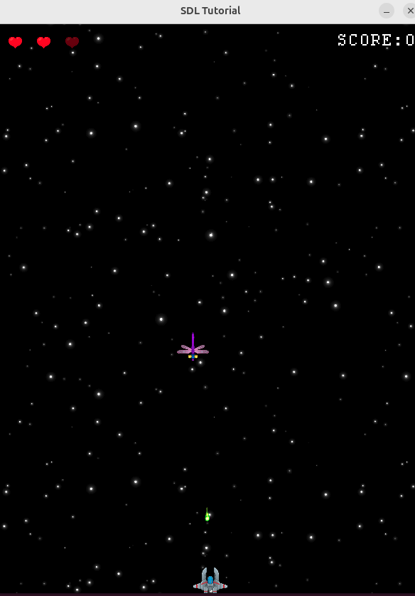
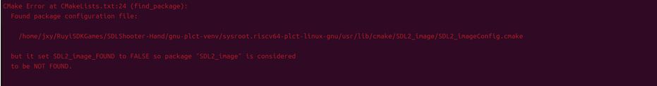
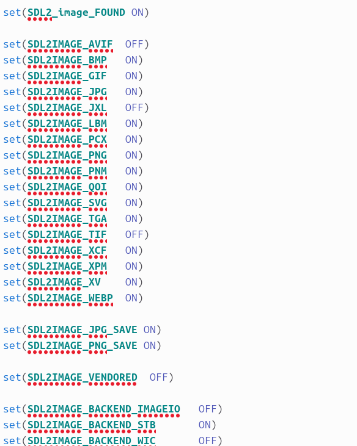

使用 ruyisdk 创建虚拟环境并编译太空射击游戏

## 开始

获取项目:
```
git clone https://github.com/WispSnow/SDLShooter.git

cd SDLShooter
```
## 创建虚拟环境
- 在项目路径下，在终端输入以下命令：

```
ruyi venv -t gnu-plct -e qemu-user-riscv-upstream generic ./gnu-plct-venv
```

## 制作 sysroot
由于游戏项目需要依赖 libxmp, SDL_mixer,SDL_ttf, SDL_image等，现在需要重新配置虚拟环境下的 sysroot
- 移除 sysroot 目录下的文件，防止冲突，注意当前所在的位置是克隆的项目目录下：
```
rm -rf $PWD/gnu-plct-venv/sysroot/*
```
- 在 Ubuntu 上安装必要依赖并初始化 sysroot：
```
sudo apt install -y qemu-user-static dnf

mkdir -p $PWD/gnu-plct-venv/sysroot/usr/bin
cp /usr/bin/qemu-riscv64-static $PWD/gnu-plct-venv/sysroot/usr/bin/

sudo dnf --installroot=$PWD/gnu-plct-venv/sysroot \
           --forcearch=riscv64 \
           --releasever=24.03 \
            --repofrompath=oe-base,https://mirrors.huaweicloud.com/openeuler/openEuler-24.03-LTS/OS/riscv64/ \
            --repofrompath=oe-update,https://mirrors.huaweicloud.com/openeuler/openEuler-24.03-LTS/update/riscv64/ \
            --disablerepo=* --enablerepo=oe-base,oe-update \
            --nogpgcheck \
            --setopt=install_weak_deps=False \
            install -y bash coreutils dnf openEuler-release

sudo cp /etc/resolv.conf $PWD/gnu-plct-venv/sysroot/etc/resolv.conf
```
- 调整sysroot权限：
```
sudo chown -R $USER:$USER $PWD/gnu-plct-venv/sysroot && sudo chown -R $USER:$USER $PWD/gnu-plct-venv/sysroot.riscv64-plct-linux-gnu

sudo chmod -R 775 $PWD/gnu-plct-venv/sysroot && sudo chmod -R 775 $PWD/gnu-plct-venv/sysroot.riscv64-plct-linux-gnu
```
- 进入 openEuler 安装依赖:
```
sudo chroot $PWD/gnu-plct-venv/sysroot /bin/bash

dnf install SDL2-devel freetype-devel libpng-devel wavpack-devel mesa-dri-drivers mesa-libGL-devel libX11-devel zlib-devel openssl-devel libXext-devel libXcursor-devel libXinerama-devel libXi-devel fluidsynth-devel opus-devel opusfile-devel libogg-devel wavpack-devel freetype-devel libpng-devel libjpeg-turbo-devel libwebp-devel libtiff-devel SDL2-static glibc-devel

dnf groupinstall -y "Development Tools"
```
如图出现如下面板：



### 手动编译一些依赖
手动创建设备文件,保证 openEuler 可以成功使用 git:
```
mknod -m 666 /dev/urandom c 1 9
mknod -m 666 /dev/random c 1 8
```
- 克隆手动编译依赖的源码:
```
mkdir PkgDownload && cd PkgDownload
# 克隆 libxmp 源码
git clone https://github.com/libxmp/libxmp.git
```
- 对于 SDL_mixer，SDL_ttf，SDL_image，同理进行克隆源码，注意执行命令的目录是在 PkgDownload 下~
```
git clone https://github.com/libsdl-org/SDL_mixer.git && cd SDL_mixer && git checkout SDL2

git clone https://github.com/libsdl-org/SDL_ttf.git && cd SDL_ttf && git checkout SDL2

git clone https://github.com/libsdl-org/SDL_image.git && cd SDL_image && git checkout SDL2
```
- 分别进入克隆的依赖的目录下，如 ` cd libxmp`编译并安装:
```
mkdir build && cd build

cmake .. -DCMAKE_INSTALL_PREFIX=/usr

make -j$(nproc)

make install

ldconfig
```
- 上面的4个依赖安装完成后，退出 bash 面板:
```
exit
```
- 更改配置文件:
```
cd $PWD/gnu-plct-venv/sysroot
#更改SDL2.config.cmake
find usr/lib64/cmake -name "*.cmake" -exec sed -i 's|"/usr|"${CMAKE_SYSROOT}/usr|g' {} +
```
## 编译并运行游戏项目
### 编译
进入游戏 SDLShooter 目录下:
```
mkdir build && cd build
# 先回到上一级
cd ..
# 直接构建
cmake -S . -B build \
      -DCMAKE_TOOLCHAIN_FILE=$PWD/gnu-plct-venv/toolchain.cmake \
      -DCMAKE_SYSROOT=$PWD/gnu-plct-venv/sysroot \
      -DCMAKE_EXE_LINKER_FLAGS="-static-libstdc++ -static-libgcc"

cd ./build && make
```
### 运行游戏
- 激活虚拟环境:
```
cd ..

source ./gnu-plct-venv/bin/ruyi-activate
```
- 运行游戏:
```
env SDL_AUDIODRIVER=dummy LIBGL_ALWAYS_SOFTWARE=1 ruyi-qemu -L $PWD/gnu-plct-venv/sysroot ./build/SDLShooter-Linuxs
```


## 可能出现的问题
如果在编译游戏项目的过程中有如下报错：



需要把报错路径下的配置文件中的参数改为如下图所示：


