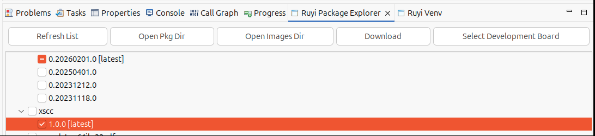
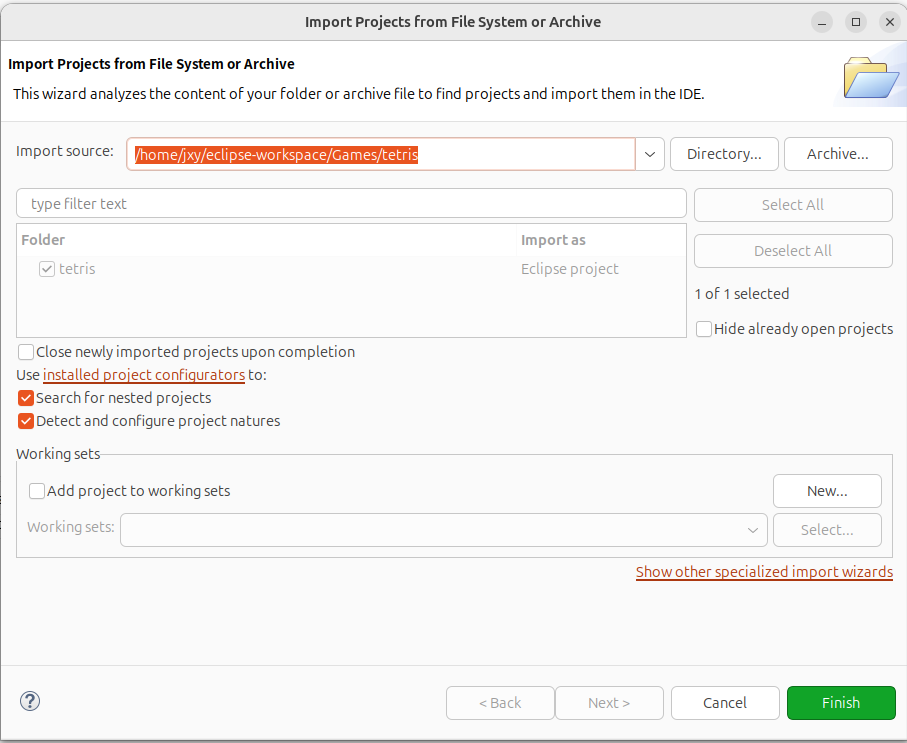
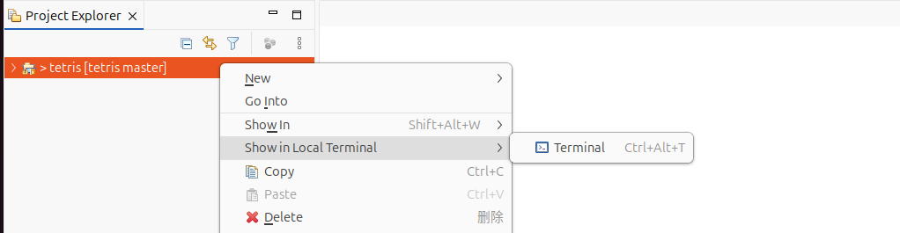
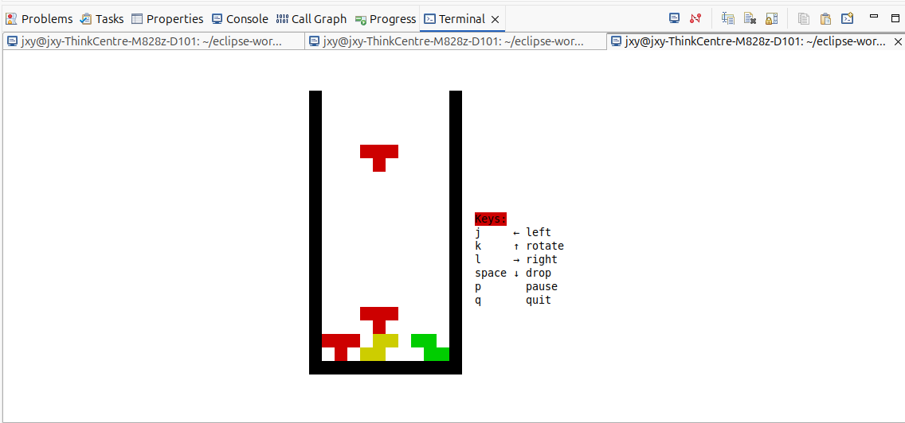

XSCC 快速上手：基于 RuyiSDK 的游戏编译
本文介绍基于 RuyiSDK 安装 XSCC 工具链，以 tetris 和 2048 游戏为例，演示通过 XSCC 编译游戏代码并在 ruyi-qemu 运行 RISC-V 可执行文件的流程。
## 开始
### 使用 ruyi 安装 xscc 工具链
```
ruyi update

ruyi list --name-contains 'xscc'

ruyi install xscc
```
### 当然也可以使用 Eclipse 中的 RuyiSDK 插件安装 xscc
- 打开 Eclipse，找到顶部菜单栏的 Window -> Show View -> Other -> RuyiSDK -> Ruyi Package Explorer 进入包管理器
- 选择 xscc 工具链并点击 Download
- 等待下载完毕～



## 使用 xscc 编译游戏
### 获取游戏项目
```
git clone https://github.com/troglobit/tetris.git
```
### 使用 Eclipse 打开
找到顶部菜单栏：File -> Open Projects from File System...


### 创建虚拟环境
- 打开终端(右键项目目录)，进入项目目录

- 输入下面的命令,即可创建虚拟环境`xscc-venv`
```
ruyi venv -t xscc --sysroot-from gnu-plct-xthead generic -e qemu-user-riscv-xthead  ./xscc-venv
```

### 激活环境并编译游戏
- 激活虚拟环境，命令行输入：
```
source ./xscc-venv/bin/ruyi-activate
```
- 使用 xscc 中的 clang 编译游戏
```
clang ./tetris.c -o ./tetris-clang
```
- 当然也可以使用 xscc 中的 gcc
```
riscv64-unknown-linux-gnu-gcc ./tetris.c -o ./tetris-gcc
```
- 游玩
```
ruyi-qemu ./tetris-clang
```



另一篇博客[基于 RuyiSDK 虚拟环境编译 2048 并在 QEMU 运行 RISC-V 可执行文件](https://ruyisdk.cn/t/topic/2520/3)也可使用 xscc 工具链进行编译，命令贴在下面：
```
git clone https://github.com/mevdschee/2048.c.git

cd 2048.c

ruyi venv -t xscc --sysroot-from gnu-plct-xthead generic -e qemu-user-riscv-xthead  ./xscc-venv

source ./xscc-venv/bin/ruyi-activate

clang ./2048.c -o ./2048-clang

ruyi-qemu ./2048-clang
```